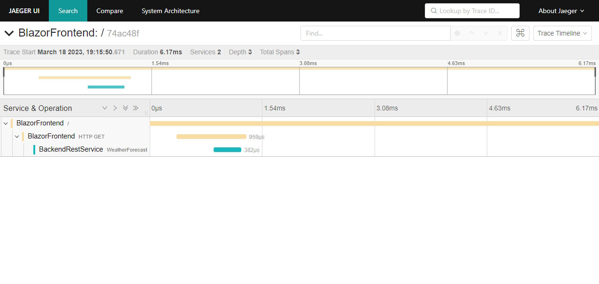

# C# Instrumentation using OpenTelemetry

OpeneTelemetry for .NET Ddocumentation:
- [Official website](https://opentelemetry.io/docs/instrumentation/net/getting-started/)
- [GitHub page](https://github.com/open-telemetry/opentelemetry-dotnet)

## Nuget Packages

Add the following packages to your project

- [OpenTelemetry.Extensions.Hosting](https://github.com/open-telemetry/opentelemetry-dotnet/tree/main/src/OpenTelemetry.Extensions.Hosting)
- [OpenTelemetry.Instrumentation.AspNetCore](https://github.com/open-telemetry/opentelemetry-dotnet/blob/main/src/OpenTelemetry.Instrumentation.AspNetCore/README.md)
- [OpenTelemetry.Instrumentation.Http](https://github.com/open-telemetry/opentelemetry-dotnet/blob/main/src/OpenTelemetry.Instrumentation.Http/README.md) 
- [OpenTelemetry.Exporter.Console](https://github.com/open-telemetry/opentelemetry-dotnet/tree/main/src/OpenTelemetry.Exporter.Console)   
- [OpenTelemetry.Exporter.OpenTelemetryProtocol](https://github.com/open-telemetry/opentelemetry-dotnet/tree/main/src/OpenTelemetry.Exporter.OpenTelemetryProtocol)

```bash
dotnet add package OpenTelemetry.Extensions.Hosting
dotnet add package OpenTelemetry.Exporter.Console   
dotnet add package OpenTelemetry.Instrumentation.AspNetCore --prerelease
dotnet add package OpenTelemetry.Exporter.OpenTelemetryProtocol 
dotnet add package --prerelease OpenTelemetry.Instrumentation.Http
```

## Add OpenTelemetry to the C# ServiceCollection

Add OpenTelemetry to the ServiceCollectionin the `Program.cs` file. It needs to be added in all the projects that need to be instrumented. 

```csharp
using OpenTelemetry.Metrics;
using OpenTelemetry.Resources;
using OpenTelemetry.Trace;

var builder = WebApplication.CreateBuilder(args);

// .. other setup

builder.Services.AddOpenTelemetry()
    .WithTracing(tracerProviderBuilder =>
        tracerProviderBuilder
            .AddSource(DiagnosticsConfig.ActivitySource.Name)
            .ConfigureResource(resource => resource
                .AddService(DiagnosticsConfig.ServiceName))
            .AddAspNetCoreInstrumentation()
            .AddConsoleExporter());
```

## Run

* Run OpenTelemetry Collector qnd Jaeger UI in docker.

```cmd
cd opentelemetry
docker compose up
```

* Run both .NET application

```cmd
cd opentelemetry
# backend
dotnet run --project ./csharp/microservice/backend/backend.csproj
# frontend
dotnet run --project ./csharp/microservice/frontend/frontend.csproj
```

* Navigate to http://localhost:5170. The landing page will call the backend to get the data to show.

* Navigate to http://localhost:16686, and search for the service `BlazorFrontend` or `BackendRestService` to find the traces.

  

