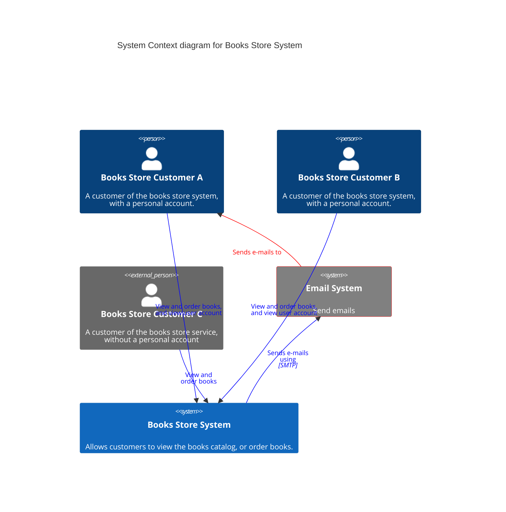
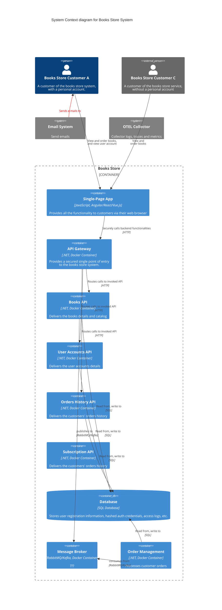
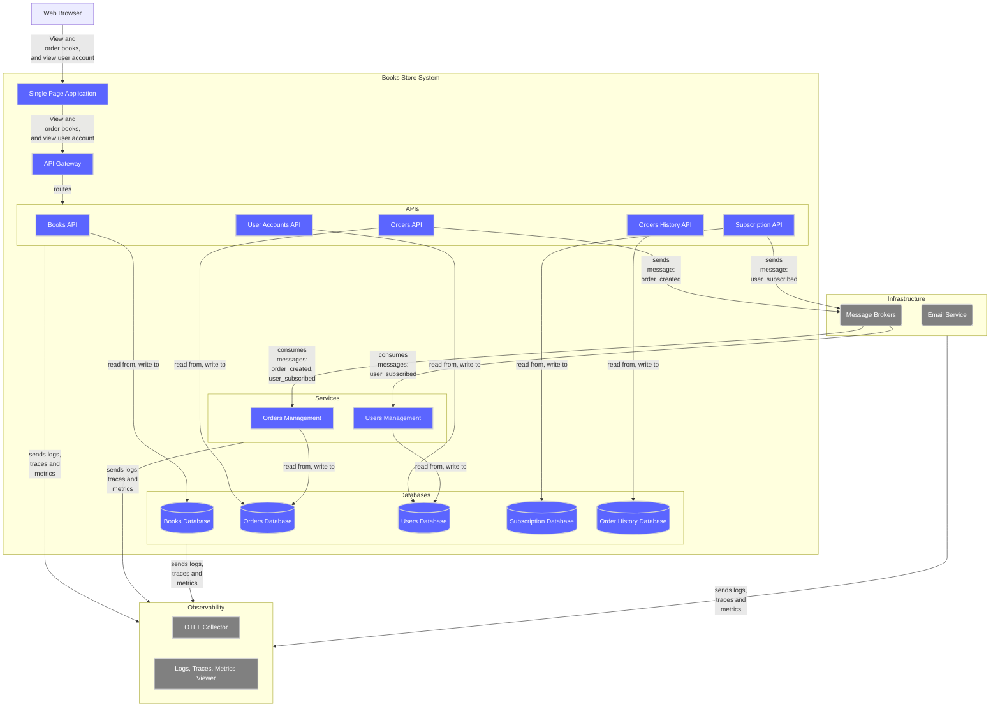

# Books Store

Personal project to put new technologies or models into practice.

## Content

- [Folder Structure](#folder-structure)
- [Technologies](#technologies)
- [Architecture](#architecture)
  - [Microservices](#microservices)
    - [C4 System Context Diagram](#c4-system-context-diagram)
    - [C4 Container Diagram](#c4-container-diagram)
- [Learning Resources](#learning-resources)

## Folder Structure

- [Docker Compose Files](./.docker)
- [Backend](./backend)
  - [Microservices Architecture](./backend/microservices)
  - [Monolithic Architecture](./backend/monolithic) - Upcoming
- [Frontend](./frontend) - Upcoming
  - [Angular](./frontend/angular) - Upcoming
  - [React](./frontend/react) - Upcoming
  - [Vue.js](./frontend/vuejs) - Upcoming

## Technologies

- Backend
  - [.NET](https://dotnet.microsoft.com/en-us/)
  - [MassTransit](https://github.com/MassTransit/MassTransit)
  - [Mediator](https://github.com/martinothamar/Mediator)
  - [OpenTelemetry](https://github.com/open-telemetry/opentelemetry-dotnet-instrumentation)
  - [Serilog](https://github.com/serilog/serilog)
- Frontend
  - [Angular](https://angular.io/)
- Infrastructure
  - PostgreSQL
  - TBD - RabbitMQ, Kafka
  - TBD - Grafana, Aspire, Jaeger/Seq
- DevOps
  - TBD - CI/CD Pipelines
  - TBD - Quality Gate
- Performances
  - [k6](https://k6.io/)

## Features

- The user can view the catalog of books
- The user can search for books
- The user can view the details of a book
- The user can order books: 3 books limit per order
- The user can create a free user account
- The user can subscribe to Premium offer
  - Increases the books limit per order to 5 books
  - Gives access to promotions
- The user can cancel his subscription
- The user can view and edit his contact info
- The user can view the status of his subscription
- The user can view his orders history

## Architecture

### Microservices

#### C4 System Context Diagram

#### C4 Container Diagram

## Learning Resources

- [C4 Models](https://c4model.com/)
